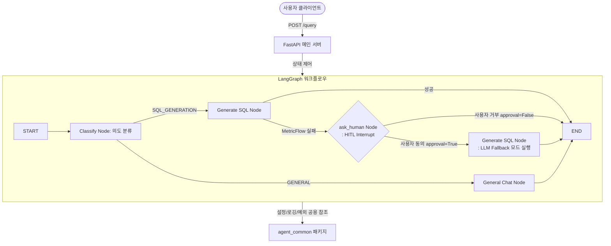

# 🤖 중앙 라우팅 에이전트 (Central Routing Agent)

이 프로젝트는 사용자의 다양한 자연어 질문을 입력받아 의도를 분석하고, 이에 따라 적절한 백엔드(SQL 생성기 API) 또는 대화 모델로 동적 라우팅하는 **FastAPI 기반 중앙 에이전트 서비스**입니다. 

LangGraph를 활용하여 상태 기반 대화 흐름을 관리하며, 하위 생성 실패 시 사용자의 명시적인 확인을 거쳐 대안을 실행하는 **Human-in-the-Loop (HITL)** 워크플로우가 구성되어 있습니다.

---

## 1. 시스템 아키텍처 및 메커니즘

이 프로젝트는 단독으로 동작하는 에이전트가 아니며, 공용 패키지 및 SQL 생성 백엔드와 긴밀히 연계되어 구동됩니다.



### 1) LangGraph 기반 Human-in-the-Loop (HITL)
* **상태 영속화**: `MemorySaver` 체크포인터를 탑재하여, 사용자 세션(`thread_id`) 단위로 상태 정보를 지속 보관합니다.
* **인터럽트 제어**: `interrupt_before=["ask_human"]` 설정을 통해, MetricFlow 모드로 SQL을 생성하다 실패할 경우 그래프는 `ask_human` 노드 바로 직전에 일시정지 상태가 됩니다.
* **동적 상태 업데이트 및 재개**:
  - 일시정지 시 클라이언트에 `session_id`와 대기 상태 알림(`is_waiting_clarification: true`)을 보냅니다.
  - 클라이언트가 동의 여부(`approval`)를 보내면 `agent_graph.update_state(..., as_node="ask_human")`를 통해 `generation_mode` 상태를 `"llm"`(승인 시) 또는 `"cancelled"`(거부 시)로 갱신한 뒤, 일시정지를 해제하여 프로세스를 완수합니다.

### 2) `agent_common` 공용 라이브러리 연동
설정과 예외 처리, 통합 로깅의 일관성 유지를 위해 독자적인 `common` 패키지를 배포용 파이썬 로컬 패키지(`agent_common`)로 추출하였습니다.
* **설정 동적 로드**: 실행 작업 디렉토리(`os.getcwd()`)를 실시간 분석하여 각 주체 프로젝트의 `config/` 하위 파일들을 병합(Merge) 로드합니다.
* **공용 LLM 클라이언트 (`agent_common.llm`)**: 내부적으로 OpenAI 호환 규격 API 및 Fabrix API 인터페이스를 지원하며, `llmpool.yml`에 설정된 모델 정보를 활용하여 의도 분류 및 범용 대화를 일괄 대행합니다.

---

## 2. 주요 설정 파일 명세

서버 기동 전 `config/` 디렉터리에 위치한 설정을 반드시 점검해야 합니다.

### 1) [config/agent_config.yml](file:///c:/Users/superuser/Downloads/code/test_main_agent/config/agent_config.yml)
* **`agent_api`**: 중앙 에이전트의 FastAPI 기동 주소(`host`) 및 포트(`port`) 번호를 설정합니다.
* **`api_server`**: 연동할 SQL 생성 백엔드 서비스의 URL 주소(`base_url`: 기본값 `http://127.0.0.1:8000`) 및 전송 리소스 경로(`generate_sql_path`)를 명시합니다.
* **`llm`**: 라우팅 목적에 사용할 활성 모델의 프로필 식별자(`router_model`: 예 `openai_gpt4o`)를 지정합니다.

### 2) [config/llmpool.yml](file:///c:/Users/superuser/Downloads/code/test_main_agent/config/llmpool.yml)
* **`llm_pool`**: 사용 가능한 외부 API 제공 모델 정보들을 명시합니다.
  - `provider`: 제공 형태를 나타내며, `external`은 외부 API 연동을 의미합니다.
  - `api_key_env`: 인증 키를 읽어올 때 탐색할 시스템 환경변수 이름입니다. (예: `EXTERNAL_LLM_API_KEY`)
  - `model`: 호출 대상 외부 LLM의 구체적인 모델 식별 정보입니다. (예: `gpt-4o-mini`)

---

## 3. API 엔드포인트 명세

### 1) 헬스체크 (`GET /health`)
에이전트 서비스의 활성화 상태를 확인하기 위한 무상태(Stateless) API입니다.
* **응답 규격**:
  ```json
  { "status": "ok" }
  ```

### 2) 메인 질의 라우터 (`POST /query`)
사용자의 모든 질문을 수신하여 분석 및 재개를 처리합니다.

* **요청 바디 필드 설명 (JSON)**:
  - `query` (선택): 의도 분류 및 라우팅 대상이 되는 자연어 문장 (신규 세션 시작 시 필수이며 최소 1자 이상).
  - `generation_mode` (선택): SQL 생성 시도 시 적용할 최초의 경로 모드. 기본값은 `"auto"` 이며, `"metricflow"`, `"llm"` 등을 직접 지정 가능합니다.
  - `session_id` (선택): 일시정지(HITL) 상태를 재개하기 위해 클라이언트가 제공하는 UUID 형태의 세션 식별 키.
  - `approval` (선택): 일시정지 상태에서 백업 일반 LLM 모드로 재시도를 진행할지에 대한 동의 플래그 (참 `true`, 거짓 `false`).

* **응답 바디 필드 설명 (JSON)**:
  - `category`: 의도 분석 결과 식별자 (`"SQL_GENERATION"` 또는 `"GENERAL"`).
  - `response`: 처리 완료된 구체적인 데이터 결과 (일반 대화 문자열 혹은 SQL 생성 결과 디테일 JSON).
  - `session_id`: 대화 흐름 추적 및 재개용 UUID 문자열.
  - `is_waiting_clarification`: 추가 사용자 피드백 대기 여부를 의미하는 플래그 (이 값이 `true`일 경우, `session_id`와 `approval`을 매핑하여 후속 요청을 보내야 함).

---

## 4. 설치 및 실행 방법

### 1) 의존성 패키지 설치
공용 로컬 라이브러리(`agent_common`)의 동시 링크를 위해 `Editable` 모드 설치가 수반됩니다.
```bash
# 가상환경 활성화 (Windows PowerShell 기준)
.\venv312\Scripts\Activate.ps1

# 공용 모듈을 로컬 링크 모드로 연동하여 의존성 라이브러리 전체 설치
pip install -e ../agent_common
pip install -r requirements.txt
```

### 2) 환경변수 설정
사용할 LLM 제공업체의 API 인증 키를 환경변수에 등록합니다.
```powershell
# Windows PowerShell 기준 API 키 주입 예시
$env:EXTERNAL_LLM_API_KEY="sk-proj-your-openai-api-key..."
$env:GROQ_API_KEY="gsk_your-groq-api-key..."
```

### 3) 에이전트 서비스 실행
```bash
python src/main.py
```
성공적으로 기동되면 `Uvicorn running on http://127.0.0.1:8080` 로그 메시지가 출력됩니다.

---

## 5. API 호출 예시 (PowerShell)

### 신규 질문 시작 (MetricFlow 전용 모드로 요청)
```powershell
$body = @{
    query = "jaffle-shop 프로젝트의 총 주문수를 보여줘"
    generation_mode = "metricflow"
} | ConvertTo-Json

$res = Invoke-RestMethod -Uri "http://127.0.0.1:8080/query" -Method Post -Body $body -ContentType "application/json; charset=utf-8"
$res | Format-List
```
*응답 내에 `is_waiting_clarification: True` 및 발급된 `session_id`가 수신됩니다.*

### 대화 흐름 재개 (일반 LLM fallback 승인)
```powershell
$resumeBody = @{
    session_id = "수신한_session_id_입력"
    approval = $true
} | ConvertTo-Json

$finalRes = Invoke-RestMethod -Uri "http://127.0.0.1:8080/query" -Method Post -Body $resumeBody -ContentType "application/json; charset=utf-8"
$finalRes.response
```
